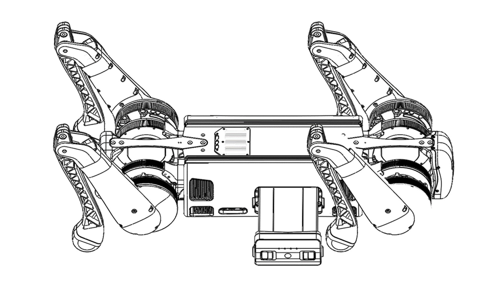
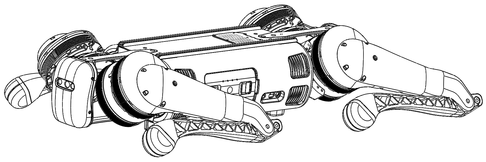

===============
B1 Basic Usage
===============

.. contents::
    :local:

Startup
=======

Installing Battery Pack
-----------------------

Make sure the battery pack is fully charged.
Place the B1 on a flat surface.
Insert the battery into the side of the robot.
The battery can only be fully inserted one way; if it cannot be inserted, flip it over and try again.
The battery should click into place and is not fully installed if no click is heard.

.. _label-basic-usage-startup-pose:

Startup Pose
------------

In order for the robot to boot properly, it must be in its startup pose before being powered on.
The robot must be flat on its belly with its legs out to the side and have its feet and knees touching the ground.

Powering On The Robot
---------------------

With the battery inserted into the robot, press the button on the battery once with a short press followed by another long press.
Hold the second press until the lights flash and you hear the fans on the robot start up.

Powering on the Handheld Controller
-----------------------------------

Press the power button on the controller once with a short press followed by another long press.
Hold the second press until a beep is heard and the LEDs on the side of the controller turn on.
The controller will automatically connect to the B1.

See :doc:`Handheld Controller Operation<../operation/handheld>` for details.

Troubleshooting
---------------

See the :doc:`Troubleshooting Startup<../troubleshooting>` page for details.

Shutdown
========

Powering Off The Robot
----------------------

Walk the B1 to a flat surface.

Do the following operations using the handheld controller in order:

1.  On the handheld, press :kbd:`L2` + :kbd:`A` to lock the robot's joints.
2.  On the handheld, press :kbd:`L2` + :kbd:`A` again to make the robot lie down.
3.  Once on the ground, press the power button on the battery once with a short press followed by another long press.
4.  Hold the second press until the lights on the robot turn off.
5.  Remove the battery from the robot.
