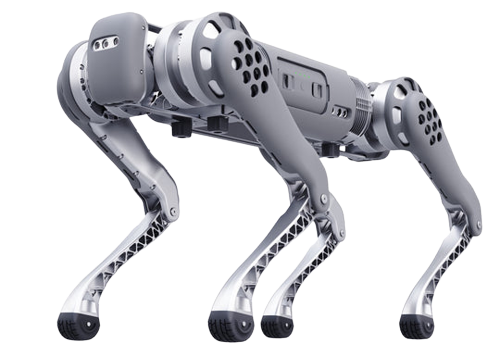

==========
Unitree B1
==========

.. note::

    This documentation is currently under construction and resources may change locations without warning.
    Items may also not be correct — feel free to `submit an issue report or PR`_ to address any problems you come across.

.. _`submit an issue report or PR`: https://github.com/TrossenRobotics/unitree_b1_docs/issues?q=

What's Here
===========

*   :doc:`getting_started` - These guides will walk you through the setup process for your B1.
*   :doc:`operation` - These guides will details concepts related to the operation of the B1.
*   :doc:`specifications` - Contains specification information for the B1 and related hardware.
*   :doc:`downloads` - Downloadable content related to the B1.
*   :doc:`troubleshooting` - Troubleshooting and support guides for the B1.

Table of Contents:
==================

.. toctree::
    :titlesonly:

    getting_started.rst
    operation.rst
    specifications.rst
    downloads.rst
    troubleshooting.rst
