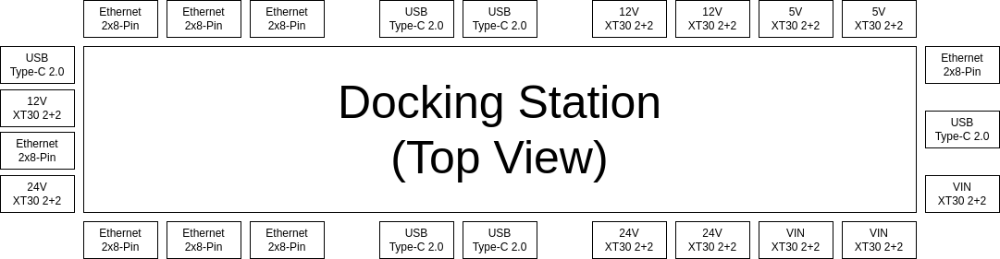
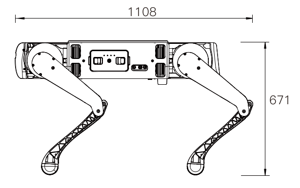
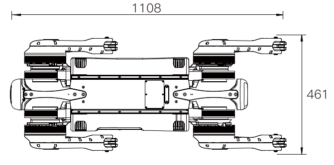

==============
Specifications
==============

.. contents::
    :local:

Packing List
============

*   1x B1 Robot
*   1x B1 Battery
*   1x B1 Battery Charger
*   1x Remote Controller
*   1x 1m Remote Controller Charger and Type-C Cable
*   4x Foot End Caps
*   2x 100cm XT30 (2+2) Power Cable
*   1x 10cm Power and Ethernet Cable
*   16 core convert to RJ45 / power / 485 junction box
*   3x XT30 (2+2) Waterproof Plug
*   3x Power And Ethernet Cable Waterproof Plug
*   USB Type-C Waterproof Plug
*   1x Foot Removal Wrench
*   1x Hex Key
*   1x Leg Calibration Tool

Specifications Overview
=======================

Physical Specifications
-----------------------

.. list-table::
    :align: center
    :widths: 40 60

    * - Size
      - *   Standing: 1108mm x 461mm x 671mm
        *   Folded: 964mm x 461mm x 275mm
    * - Weight
      - 50kg
    * - Max Walking (Continuous Working Load) Payload
      - 40kg
    * - Max Standing (Maximum Working Load) Payload
      - 104kg
    * - Max Speed
      - 1.8m/s
    * - Operating Time
      - 2-4h
    * - Climbable Stair Height
      - 20cm
    * - Climbable Slope
      - 35°
    * - External Interfaces
      - 6x Gigabit Ethernet Ports, 4x RS485 Ports, 5x USB Type-C Ports, 4x CAN ports
    * - External Power Interfaces
      - 5V, 12V, 24V, 51V (Battery)
    * - Visual Sensors
      - 5x Stereo Depth Cameras
    * - Internal Computers
      - 3x Jetson Xavier NX
    * - Ingress Protection Rating
      - IP68

Docking Station
---------------

The top of the robot provides breakouts for networking devices, serial devices, and power.

.. container:: no-table

    .. list-table::
        :align: center

        * - .. image:: specifications/images/docking_station.png
          - .. list-table::
                :align: left
                :widths: 10 25

                * - .. image:: specifications/images/gb_eth.png
                  - 2x 8-pin Gigabit Ethernet Interface
                * - .. image:: specifications/images/usbc.png
                  - USB Type-C 2.0 Interface
                * - .. image:: specifications/images/xt30.png
                  - XT30 (2+2) Power Interface

Included in the docking stations are seven Ethernet ports, five USB Type-C ports, and ten power ports.

*   2x8PIN Gigabit Ethernet Interface+12V Power Supply+485/CAN (Pass-through) Interface:

    1.  Total number of interfaces: 8 (2x8PIN waterproof interfaces)
    2.  Gigabit Ethernet: 1 channel is connected to the robot Mini PC, 7 channels are connected to external
    3.  Power Output: 12V x 7 channels, 10A electric current in total (same path as external power supply)
    4.  485/CAN (Pass-through): 3-Interface CHA channel 485/CAN, 3-interface CHB channel 485/CAN

*   Type-C USB2.0 Interface:

    1.  Total number of interfaces: 6 interfaces (Type-C waterproof interface)
    2.  7-channel USB-HUB: The generatrix is connected to the robot Mini PC. 5 channels are connected to the external; 2 channels are connected to 2 groups of USB, and then transfer to 485 (or CAN) Pass-through modules: CHA/CHB
    3.  Power output: 5V/1A x 5 channels (USB power supply is independent of external power supply)

*   XT30(2+2) power supply +485/CAN (Pass-through) interface:

    1.  36-58V input/output: 3 channels 10A electric current in total, CHA channel 2 interfaces 485/CAN + CHB channel 1 interface CAN/485
    2.  24V output: 3 channels 10A electric current in total, CHA channel 2 interfaces 485/CAN + CHB channel 1 interface CAN/485
    3.  12V output: 3 channels 10A electric current in total, CHB channel 2 interfaces 485/CAN + CHA channel 1 interface CAN/485
    4.  5V output: 2 channels 5A electric current in total, CHB channel 1 interface 485/CAN + CHA channel 1 interface CAN/485

Major Dimensions
================

